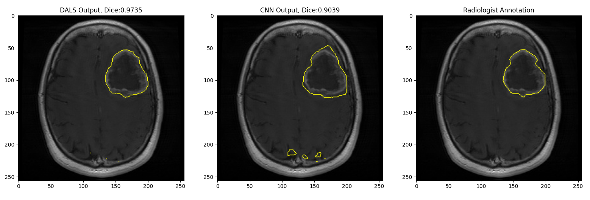
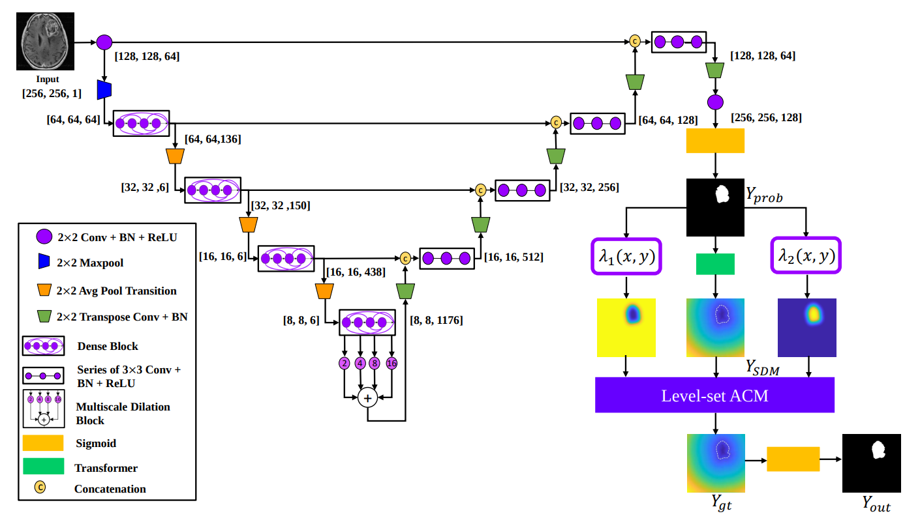
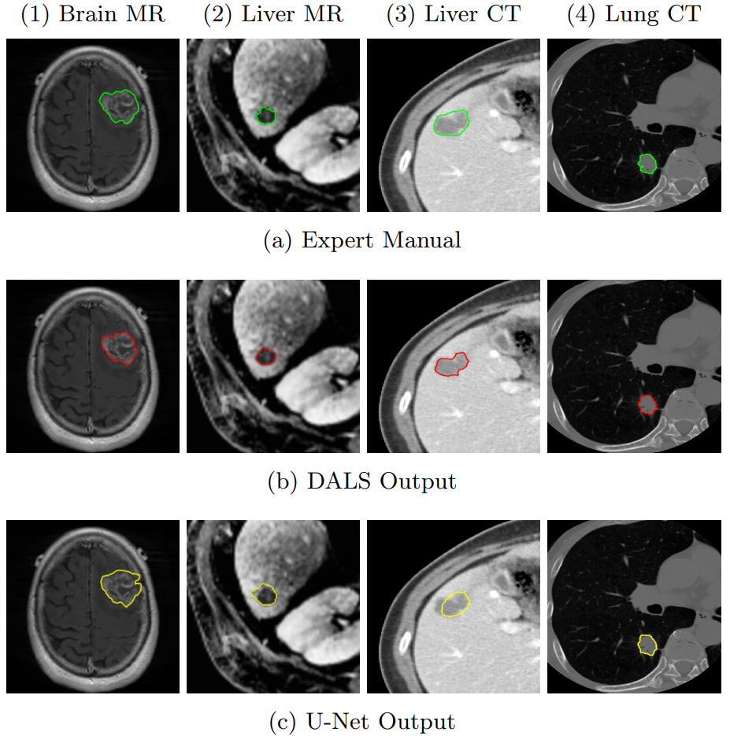

# Deep Active Lesion Segmentation


Official repositoy for Deep Active Lesion Segmentaion ( DALS ). 

DALS offers a fast levelset active contour model, implemented entirely in Tensorflow, that can be paired with any CNN backbone for image segmentation. 

# Demo

In this demo, the CNN output is not exact and entails artifacts outside the regions of interest (lesion). Given such a sub-optimal initial condition, our DALS framework still is capable of delineating the boundaries and significantly improving the results.


To run the demo, simply run the following command: 
```
python main_demo.py --img_resize=256 --acm_iter_limit=600 --batch_size=1 
```
This runs the levelset active contour model, as introduced in DALS, for 600 iterations for an image of size 256 by 256 with a batch size of 1. Running the levelset in higher number of batches is also possible. 

Using a NVIDIA TitanXP GPU, the entire demo runs for approximately 3 seconds.  

# Paper



Official Paper: [Link](https://link.springer.com/chapter/10.1007/978-3-030-32692-0_12) <br/>

ArXiv Paper: [Link](https://arxiv.org/pdf/1908.06933.pdf) <br/>

If you use the DALS framework, its fast Tensorflow-based levelset active contours or its CNN backbone ( Dilated Dense U-Net ), please cite our paper:  

```
@inproceedings{hatamizadeh2019deep,
  title={Deep active lesion segmentation},
  author={Hatamizadeh, Ali and Hoogi, Assaf and Sengupta, Debleena and Lu, Wuyue and Wilcox, Brian and Rubin, Daniel and Terzopoulos, Demetri},
  booktitle={International Workshop on Machine Learning in Medical Imaging},
  pages={98--105},
  year={2019},
  organization={Springer}
}
```

# Environment Setup

To install all the requirments for this project, simply run this: 
```
pip install -r requirments.txt 
```

Note that this work uses the last version of Tensorflow 1.x which is (1.15.0). Assuming that conda is installed in your system, and if you needed to install the cuda and cuDNN compatible verisons for Tensorflow, you can simply use:

```
conda create --name tf_gpu tensorflow-gpu==1.15.0 
```

# Arguments 

You can pass the following argument for training and inference:
```
parser.add_argument('--logdir', default='network', type=str) # Directory to save the model
parser.add_argument('--mu', default=0.2, type=float) # mu coefficient in levelset acm model 
parser.add_argument('--nu', default=5.0, type=float) # nu coefficient in levelset acm model
parser.add_argument('--batch_size', default=1, type=int) # batch size 
parser.add_argument('--train_sum_freq', default=150, type=int) # Frequency of validation during training
parser.add_argument('--train_iter', default=150000, type=int) # Number of training iterations
parser.add_argument('--acm_iter_limit', default=300, type=int) # Number of levelset acm iterations
parser.add_argument('--img_resize', default=512, type=int) # Size of input image
parser.add_argument('--f_size', default=15, type=int) # Size of pooling filter for fast intensity lookup ( in levelset acm model)
parser.add_argument('--train_status', default=1, type=int) # Status of training. 1: train from scratch 2: continue training from last checkpoint 3: inference  
parser.add_argument('--narrow_band_width', default=1, type=int) # Narrowband width in levelset acm model
parser.add_argument('--save_freq', default=1000, type=int) # Frequency of saving the moidel during training 
parser.add_argument('--lr', default=1e-3, type=float) # Training learning rate 
parser.add_argument('--gpu', default='0', type=str) # Index of gpu to be used for training

```

For instance, if you wanted to train with a batchsize of 4 and input image size of 256, you need to run:

```
python main.py --train_status=1 --img_resize=512 --batch_size=4 
```

# Dataset Structure

For training, the dataloader expects all the files to be numpy arrays (.npy). Images and labels need to be put in the same folder. For example, the training folder looks like this

```
train/
    img1_input.npy
    img1_label.npy 
```


# Segmentation comparison of DALS with Expert Radiologist and U-Net 




